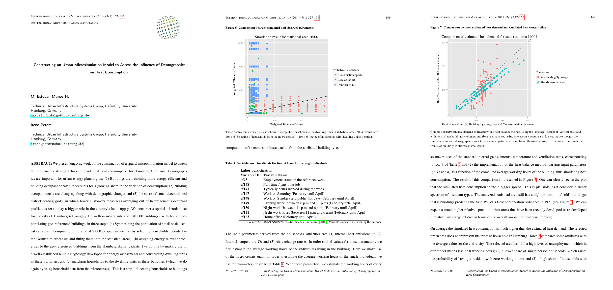

=================================
IJM articel style class for latex 
=================================

:Author: Esteban Munoz
:Version: 1.0
:Date: 12 December 2014

.. contents:: Table of Contents
   :depth: 2

Description
===========

This is the repository dedicated to the maintenance and further develop of the
latex article template for the `International Journal of Microsimulation`_.

This template has been developed to fit the current template of the journal.

The template has been develop under the assumption that it will be compiled
using pdflatex_. Depending on the contents of the paper the template may also
be compiled using a different method.

This template requires some additional packages in order to compile, please
refer to section `Used Packages`_ for further information and links to the
individual packages. 

Files
=====

+------------------+------------------------------------+
| **File**         | **Description**                    |
+==================+====================================+
| IJM-article.cls_ | Style class                        |
+------------------+------------------------------------+
| readme.pdf_      | This File                          |
+------------------+------------------------------------+
| IJM-article.tex_ | Article example, you can edit this |
|                  | file                               |
+------------------+------------------------------------+
| logo.png         | IJM logo                           |
+------------------+------------------------------------+
| FIGURES_         | Folder with sample figures         |
+------------------+------------------------------------+
| IJM-article.pdf_ | Sample article                     |
+------------------+------------------------------------+

Used packages
=============

+-------------+----------------------------------------------------+
| **Package** | **Description**                                    |
+=============+====================================================+
| hyperref_   | Handle cross-referencing commands                  |
+-------------+----------------------------------------------------+
| graphicx_   | Needed to use the ``\includegraphics`` command.    |
|             | Used to display the IJM logo                       |
+-------------+----------------------------------------------------+
| lastpage_   | Reference last page of the document                |
+-------------+----------------------------------------------------+
| setspace_   | Define space between lines                         |
+-------------+----------------------------------------------------+
| parskip_    | Define ``\parindent`` (paragraph indent) and       |
|             | ``\parskip`` (space between paragraphs)            |
+-------------+----------------------------------------------------+
| url_        | Handle web address and email address inputs        |
+-------------+----------------------------------------------------+
| textpos_    | Allows for absolute positioning of text and images |
+-------------+----------------------------------------------------+
| apacite_    | Format bibliography in APA style                   |
+-------------+----------------------------------------------------+
| endnotes_   | Convert footnotes to endnotes                      |
+-------------+----------------------------------------------------+
| ccaption_   | Format captions                                    |
+-------------+----------------------------------------------------+
| faccyhdr_   | Format header and footer                           |
+-------------+----------------------------------------------------+
| geometry_   | Manipulate the geometry of the layout              |
+-------------+----------------------------------------------------+
| mathdesign_ | Provides Garamond fonts. This package collides     |
|             | with other math fonts (e.g. mathptmx_)             |
+-------------+----------------------------------------------------+

.. _mathptmx: http://ctan.org/pkg/mathptmx
.. _mathdesign: http://www.ctan.org/tex-archive/fonts/mathdesign/
.. _hyperref: http://ctan.org/pkg/hyperref
.. _graphicx: http://ctan.org/pkg/graphicx
.. _lastpage: http://ctan.org/pkg/lastpage
.. _setspace: http://ctan.org/pkg/setspace
.. _parskip: http://ctan.org/pkg/parskip
.. _url: http://ctan.org/pkg/url
.. _textpos: http://ctan.org/pkg/textpos
.. _apacite: http://ctan.org/pkg/apacite
.. _endnotes: http://ctan.org/pkg/endnotes
.. _ccaption: http://ctan.org/pkg/ccaption
.. _faccyhdr: http://ctan.org/pkg/fancyhdr
.. _geometry: http://ctan.org/pkg/geometry
.. _IJM-article.cls: https://github.com/emunozh/IJM-Template/blob/master/IJM-article.cls
.. _readme.pdf: https://github.com/emunozh/IJM-Template/blob/master/IJM-article.pdf 
.. _FIGURES: https://github.com/emunozh/IJM-Template/blob/master/FIGURES
.. _IJM-article.tex: https://github.com/emunozh/IJM-Template/blob/master/IJM-article.tex
.. _IJM-article.pdf: https://github.com/emunozh/IJM-Template/blob/master/IJM-article.pdf
.. _International Journal of Microsimulation: http://www.microsimulation.org/IJM/
.. _pdflatex: http://www.tug.org/applications/pdftex/
